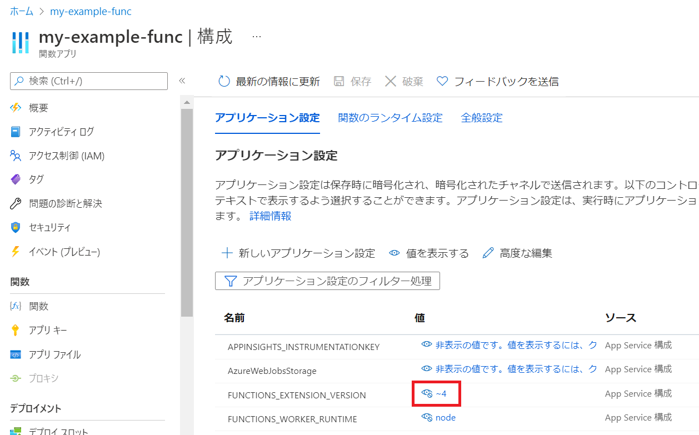

# その他

## Visual Studio Code でのローカルデバッグについて

https://docs.microsoft.com/ja-jp/azure/azure-functions/functions-develop-vs-code

Visual Studio Codeに`Azure Functions 拡張機能`をインストールする。
ソースコードにブレークポイントを設定して、F5を押してアプリを実行する。

### 関連する設定

./vscode/task.json ※Pathを環境に合わせる
```
{
	"version": "2.0.0",
	"tasks": [
		{
			"type": "func",
			"command": "host start",
			"problemMatcher": "$func-node-watch",
			"isBackground": true,
			"dependsOn": "npm install (functions)",
			"options": {
				"cwd": "${workspaceFolder}/Training1_Sample_App"
			}
		},
:
```

## Functionsのランタイムバージョンについて

https://docs.microsoft.com/ja-jp/azure/azure-functions/functions-versions?tabs=in-process%2Cazure-cli%2Cv4&pivots=programming-language-javascript

ランタイムについては現在、1.x, 2.x, 3.x, 4.x とあります。
今回はnodeを選択して、4.xを利用しています。プログラミング言語によって利用するバージョンが決定する。今回は`Node.js 14`を利用していたので`4.x`を選択しています。

## FUNCTIONS_EXTENSION_VERSION
ランタイムのバージョンはアプリケーションの設定によって決まります。
ポータル画面から確認・変更ができます。

Functions作成時に指定しています。`--functions-version 4`
```
az functionapp create --functions-version 4
```

 


## Functions バインド拡張機能のバージョン

https://docs.microsoft.com/ja-jp/azure/azure-functions/functions-bindings-register

Azure Functions バージョン 2.x 以降では、トリガーとバインドは、個別のパッケージとして提供されている。

host.jsonのextensionBundleセクションで定義されています。　　
バンドルのバージョン 2.x
```
{
  "version": "2.0",
  "extensionBundle": {
    "id": "Microsoft.Azure.Functions.ExtensionBundle",
    "version": "[2.*, 3.0.0)"
  },
```
バンドルのバージョン 3.x
```
{
    "version": "2.0",
    "extensionBundle": {
        "id": "Microsoft.Azure.Functions.ExtensionBundle",
        "version": "[3.3.0, 4.0.0)"
    }
}
```
※拡張機能バンドルのバージョン 3.x には、現在、Table Storage バインディングは含まれません。 アプリで Table Storage が必要な場合は、今のところ 2.x バージョンを引き続き使用する必要があります。Durable Functionsを利用する場合は2.xが必要です。