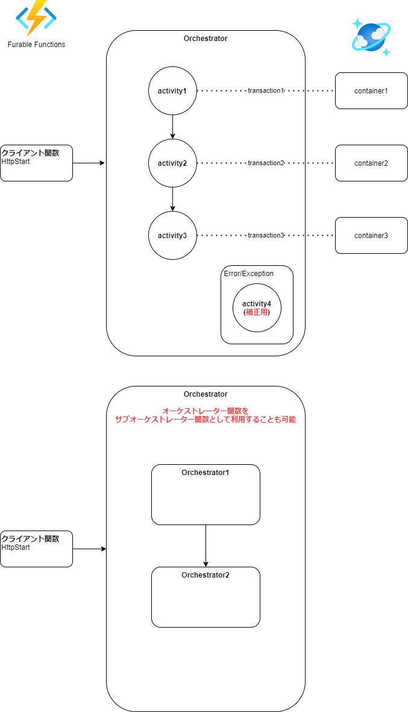

# Training 1 (/w Cosmos DB)

Cosmos DBを利用して、Durable Functionsでワークフロー、並列処理を実装する。

確認事項
エラー時(リトライ処理)
ワークフローを変更した場合
状態の管理

## シナリオ
複数のCosmosDBをへの変更処理をDurable Functionsで制御する。


## 準備(cosmos db)
Cosmos DBのアカウントを準備する。　※従量課金のサーバレスモードで作成(--capabilities EnableServerless)
```
# Create a Cosmos account for SQL API
az cosmosdb create --name "my-training1-account" --resource-group az-func-example-rg --default-consistency-level Eventual --locations regionName="japaneast" failoverPriority=0 isZoneRedundant=False --capabilities EnableServerless
```

以下のコマンドでデータベースとコンテナーを作成する  
※activity(`functions.json`)で `"createIfNotExists": true` を指定している場合は自動で作成されるため、手動で作成する必要なし。

```
# Create a SQL API database
az cosmosdb sql database create --account-name "my-training1-account" --resource-group az-func-example-rg --name training1db

# Create a SQL API container1,2,3 ※コンテナを３つ作成
az cosmosdb sql container create --account-name "my-training1-account" --resource-group az-func-example-rg --database-name training1db --name my-container1 --partition-key-path "/myid"
az cosmosdb sql container create --account-name "my-training1-account" --resource-group az-func-example-rg --database-name training1db --name my-container2 --partition-key-path "/myid"
az cosmosdb sql container create --account-name "my-training1-account" --resource-group az-func-example-rg --database-name training1db --name my-container3 --partition-key-path "/myid"
```

## Azure Functions準備

プロジェクト、関数の作成
```
func init --worker-runtime node --language javascript
func new -t "Durable Functions HTTP starter" -n HttpStart
func new -t "Durable Functions activity" -n A-CreateDB1
func new -t "Durable Functions activity" -n A-CreateDB2
func new -t "Durable Functions activity" -n A-CreateDB3
func new -t "Durable Functions orchestrator" -n O-Senario1
func new -t "Durable Functions orchestrator" -n O-Senario2
```

必要なライブラリのインストール
```
npm install durable-functions
npm install @azure/cosmos --save
npm install uuid
npm install --save applicationinsights
```

アプリをデプロイの例 (zipデプロイ)
```
>func azure functionapp publish durable-sample-func 
```

local.settings.jsonを上書き
```
>func azure functionapp publish durable-sample-func --publish-local-settings -y
```

slot指定
```
>func azure functionapp publish durable-sample-func --slot slot
```

log確認
```
>func azure functionapp logstream durable-sample-func
```


## シナリオ・内容・解説

特徴としてはワークフローのフレームワークのようにActivityの順序変更や並列処理、エラー処理（補正トランザクション）の実装を容易に行うことが可能。

| シナリオ | 内容・解説 | 備考
| --- | --- | --- |
| O-Senario1 | ３つのActivityを直列に処理する | エラーが発生した場合は補正用のActivityを処理する |
| O-Senario2 | ３つのActivityを並列に処理する | エラーが発生した場合は補正用のActivityを処理する |

 