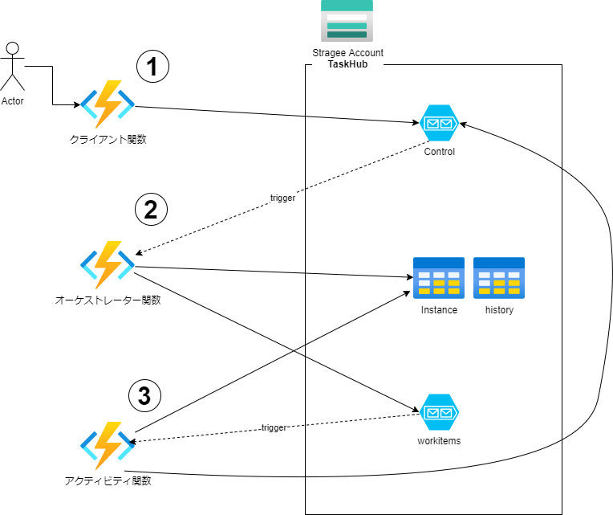

# タスクの管理 (Task Hub)

Durable Functions ではデフォルトでAzure StrageをTaskHubとして利用します。  
TaskHubではQueueとTableを利用して、Durable Functions(オーケストレーター関数、アクティビティ関数)の実行を管理します。

## 処理の流れ



1. クライアント関数がControlキューへメッセージを追加
2. オーケストレーター関数がトリガーされ、workitemsキューへメッセージを追加 ※オーケストレーター関数の処理はリプライ処理になっており、常に再実行され実行済みのアクティビティ関数についていはスキップされる。
3. アクティビティ関数がトリガーされ処理が実行、処理完了後の次の処理の為にControlキューへメッセージを追加

## 主な設定 (host.json)
TaskHubの名前など主な設定はhost.jsonで変更可能
```
host.jsonの例
{
  "version": "2.0",
  "extensions": {
    "durableTask": {
      "hubName": "Training1TaskHub",
      "storageProvider": {
        "partitionCount": 4
      }
    }
  }
}
```
