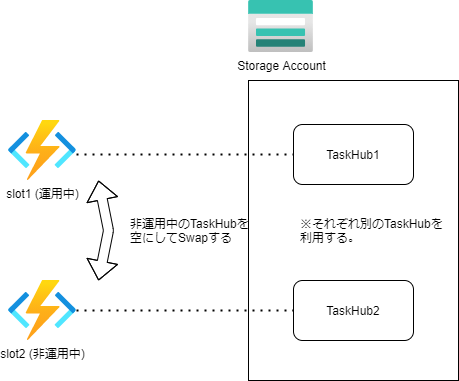

# バージョン管理

オーケストレーター関数、アクティビティ関数を変更した場合、処理中の既存のインスタンスが中断される可能がある。


## 主な対応方法
### 1. 何もしない
（非推奨しない）

### 2. 処理中のすべてのインスタンスを停止する

開発中などはこれで良い。

funcコマンドで削除して、アプリを再起動する
```
func durable delete-task-hub --task-hub-name training1taskhub
```

### 3. 並行してデプロイする

●別のストレージアカウントを使用して、新しい関数アプリとしてデプロイする ※完全に新規

●関数アプリのコピーを同じストレージアカウントを使用するが、別のタスクハブ名でデプロイする

### 4. デプロイスロット
キュートリガーやEventHubなどでトリガーされている場合は、アプリ設定を分ける必要があります。

## まとめ（注意点）
途中のワークフローの変更には対応できない。  
並行してデプロイすることを検討する。

Functionsの場合はデプロイスロットを利用してタスクハブを分けて対応する方法が有効。



(補足)TaskHubは下記のコマンドでクリアできます。
```
>func durable delete-task-hub --task-hub-name training1taskhub
```

(補足)本番環境とそれ以外は基本的にコンピューティングのリソースを分けることが推奨される。
