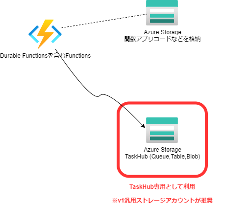
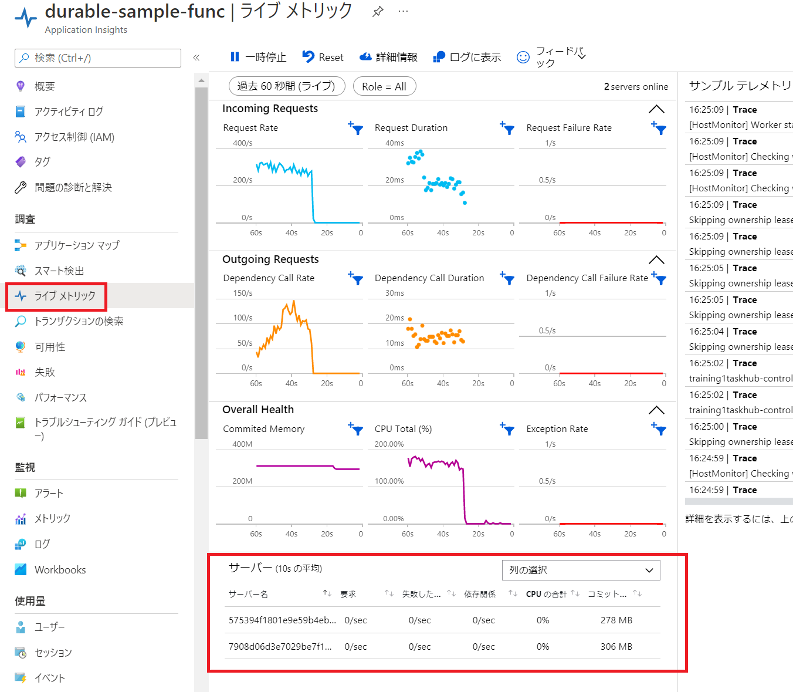

# パフォーマンスとスケーリング

https://docs.microsoft.com/ja-jp/azure/azure-functions/durable/durable-functions-perf-and-scale

## Azure Storage プロバイダー
Durable Functions の既定の構成では、Azure Storage(Queue, Table)が利用されます。
既定ではAzureWebJobsStorage(アプリケーション設定)で指定されたアカウントが利用される。パフォーマンスが重視されるワークロードの場合、既定以外のストレージアカウントを構成することが推奨。つまり下記の図のように構成する。



Durable Functions には、従来の v1 汎用ストレージ アカウントを使用することを強くお勧め
新しい v2 ストレージ アカウントでは、Durable Functions ワークロードのコストが大幅に高まるおそれがあります。

host.jsonの例
```
{
  "extensions": {
    "durableTask": {
      "storageProvider": {
        "connectionStringName": "<ここにアプリ設定の接続文字列のキーを設定>"
      }
    }
  }
}
```


## スケーリングの確認
Application Insights のライブメトリックでインスタンス数やメモリ・CPUの利用状況を簡単に確認できます。  
※Application Insightsを有効にする必要があります。


