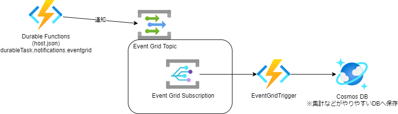

# Event Gridへの発行

https://docs.microsoft.com/ja-jp/azure/azure-functions/durable/durable-functions-event-publishing?tabs=csharp-script

## 目的
Durable Functions タスクの状態（実行中かどうかなど）をEventGridのTopicへ通知ことでTaskの状態を確認する。
並行デプロイ戦略などに活用できる。

## Event Grid トピックの作成
作成
```
az eventgrid topic create --name my-training1-topic -l japaneast -g az-func-example-rg
```
エンドポイントの取得
```
az eventgrid topic show --name my-training1-topic -g az-func-example-rg --query "endpoint" --output tsv
```
キーの取得
```
az eventgrid topic key list --name my-training1-topic -g az-func-example-rg --query "key1" --output tsv
```

## 設定(host.json)
```
{
  "version": "2.0",
  "extensions": {
    "durableTask": {
      "notifications": {
        "eventGrid": {
          "topicEndpoint": "https://<topic_name>.westus2-1.eventgrid.azure.net/api/events",
          "keySettingName": "EventGridKey"
        }
      }
    }
  }
}
```

Event Grid側のSubscription設定でFunctionsの関数を指定する  

