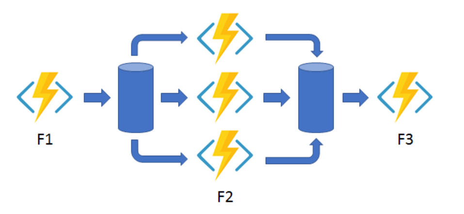
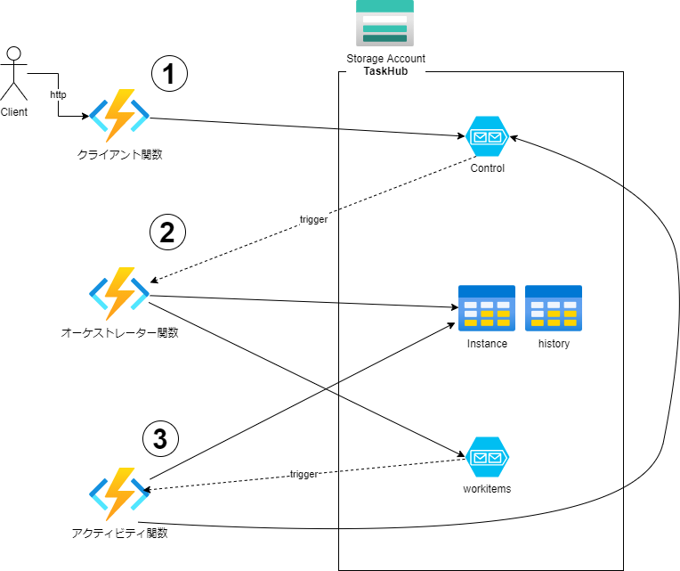

# はじめに

 

Azure FunctionsのDurable Functionsを利用する機会がありましたので、簡単に概要を纏めて置きたいと思います。非常によい拡張機能でFunctionsを使ってシステムを構築する際には是非利用したい機能になっています。

## Durable Functionsとは
Functionsで利用できるDurable Functionsとはサーバレス環境でステートフル関数を記述できる拡張機能になります。簡単に言うと「直列・並行処理、ワークフロー制御、補正トランザクション、タイマー処理など複雑になりがちなコーディングがより簡単・安全に実現できる拡張機能」と言えます。Functionsを利用することで、スケーラブルで安全なシステムが簡単に素早く実現できるようになっています。

# 導入について
公式のドキュメントが十分に整備されているので基本的に公式のクイックスタートなどを動かしながら習得していくのが良いと思います。  
Durable Functionsについては現在、C#、Javascript(/Typescript)、Pythonがサポートされいます。Functionsはサポートされている機能がプログラミング言語ごとに微妙に違うので注意が必要です。  

※今回はJavascriptで動作確認を行いました。Javascriptでのクイックスタートは[こちら](https://docs.microsoft.com/ja-jp/azure/azure-functions/durable/quickstart-js-vscode)

# 仕組みについて
Durable Functionsでは状態の管理にTaskHub(デフォルトではAzure StorageのQueueu, Table)を利用しています。
オーケストレーター関数、アクティビティ関数、クライアント関数、エンティティ関数はそれぞれQueue, Tableを参照し連携しています。

構成を簡単に図にするとこうなります。
 

# Durable Functionsの関数について
４つの関数から構成されます。特徴と内容を纏めると以下のようになります。
| 関数名 | 特徴・主な内容 |
| :--- | --- |
| オーケストレーター関数 | ワークフロー(アクティビティ関数の呼び出し順序)を実装します。  注意点として「ネットワーク呼び出しやGUID/UUIDなどの生成はオーケストレーター関数では行えない」。オーケストレーター関数は決定論的である必要があります。|
| アクティビティ関数 | 実際の処理の基本単位。外部連携の為にネットワークの呼び出しを行ったり、データベースへの更新処理などを行います。 |
| エンティティ関数 | "持続エンティティ"とよばれ、状態が常にストレージ内に持続的に保存されます。データベースのように値を保存しておいて参照することができる。 Durable Functions 2.0 以降でのみ使用できます。 |
| クライアント関数 | 関数内からオーケストレーター関数、エンティティ関数を呼び出す。 出力バインディングで`"type": "orchestrationClient"`が指定されている関数。  |

# ６つアプリケーション パターン

公式ドキュメントで紹介されている [６つのアプリケーション パターン](https://docs.microsoft.com/ja-jp/azure/azure-functions/durable/durable-functions-overview?tabs=csharp#application-patterns "アプリケーション パターン") の実装例が非常に役に立ちます。

パターンを簡単に纏めると下記のようになると思います。

| # |パターン名 | 簡単な説明・使いどころ |
| :--: | --- | --- |
| #1 | 関数チェーン | ワークフローの実現。 使い慣れたプログラミング言語を使って複雑なワークフローも簡単に実装することができます。 |
| #2 | ファンアウト/ファンイン | 並列処理の実現。 ワークフローと組み合わせてActivity単位で直列・並列を制御します。 |
| #3 | 非同期 HTTP API | トランザクションの状態をクライアントにポーリングさせて実行時間の長い処理を調整するよくあるパターン。  オーケストレーター関数の状態をクエリするWebhook HTTP APIが組み込みサポートされており自分で実装する必要がない。 |
| #4 | モニター | 柔軟な監視処理 |
| #5 | 人による操作 | 別システムやクライアントなどからのイベントを待ち受けるパターン タイマーを利用したワークフロー |
| #6 | アグリゲーター | データの集計 (※entityの利用。データベースの様に集計したデータを保存・参照できます。) |

# まとめ
Durable Functionsを触ってみて非常に良い機能だとおもいました。アプリケーションを実装していく上で、考慮すべきパターンがおおむね網羅されており、設計時にこれらを組み合わせることで質の高い設計ができると思います。Functions自体がFaaSとして提供されているので基本的な利用方法を習得してしまえば、ビジネスロジックの実装にフォーカスできます。
Durable Functionsはクラウド設計パターンで紹介されている「イベントソーシング パターン」「CQRSパターン」などが採用されておりパフォーマンス、スケーラビリティへの対応もされています。
Azure Functionsを利用して開発をする場合は、ぜひ利用していきたい機能です。

※検証につかったソースコードは[こちら](https://github.com/APCt-okuyama/az-func-learn)

# 最後に
私たちは、Azure・AKSを活用したシステムのSIや内製化のお手伝いをさせていただいております。 Azureやコンテナ技術の知見を持つエンジニアが対応いたします。ご相談等ありましたらぜひご連絡ください。

# （補足）注意点など
Durable
1. Azureの他のサービス(CosmosDBなど)との連携にはトリガーとバインドが多数用意されているのでできるだけそれを活用する  

2. Function Core Tool(CLI)での操作を習得すること (func xxx)

3. FunctionsはApplicaiton Insightと連携させて監視する  

4. Durable Functions は Azure Storage(Queue, Table) でタスク管理を行うため、Storage Accountが必要。Durable Functions 専用に用意する。

5. Linux カスタム コンテナーでも動作可能。（DurableがAKSで動かせなかった。。。）

6. Taskの監視にはEventGridを利用する

7. デプロイにはSlotを利用してTaskHubも一緒に変更するのがおすすめ

